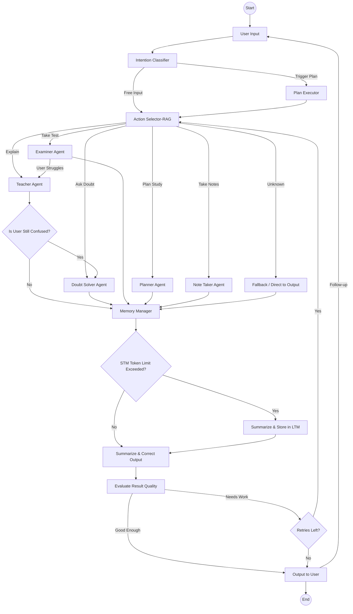
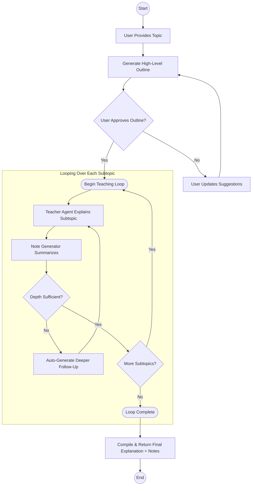

# Agent Interaction Flow Diagram [Project Path is unclear, that's why on hold]
- If you're a researcher and don't like reading too many research papers, then plz contact me will do some automation where we try to optimise the overall learning pipeline of knowledge gain by minimising effort.
- [Email](mailto:officialritwik098@gmail.com)

### Agent Descriptions

* **Teacher Agent**
  Explains concepts clearly by retrieving and synthesizing knowledge from user-uploaded documents. Acts like a personalized tutor.

* **Doubt Solver Agent**
  Handles specific questions and clarifications by leveraging document embeddings and conversational context to resolve learner doubts effectively.

* **Examiner Agent**
  Creates and evaluates quizzes or tests based on the learned material, helping users assess their understanding and track progress.

* **Planner Agent**
  Designs personalized study plans and schedules by analyzing user goals and learning history to optimize study efficiency.

* **Note Taker Agent**
  Converts interactions, summaries, and key points into structured notes, enabling easy review and retention over time.

* **Memory Manager Agent**
  Oversees short-term and long-term memory, summarizing and storing conversations to maintain context and enable multi-session learning.
