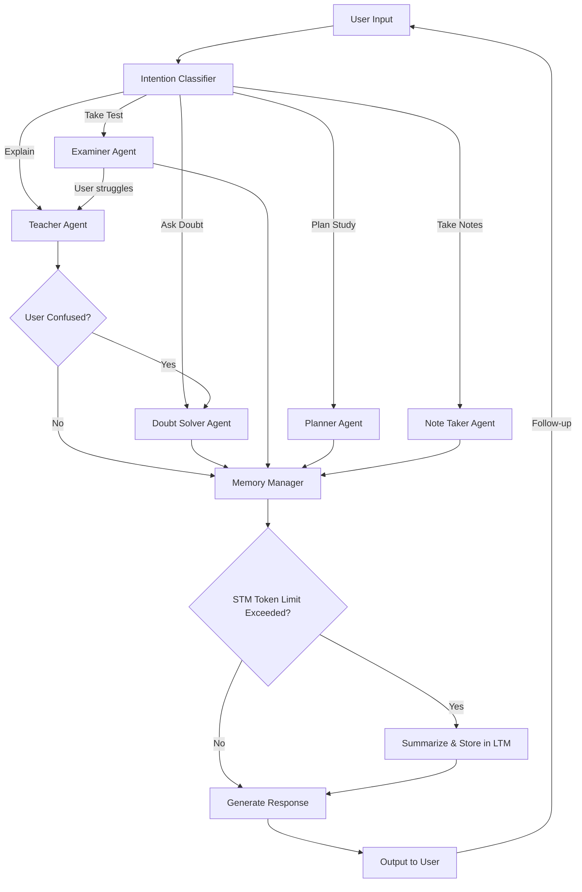

# Agent Interaction Flow Diagram

### Agent Descriptions

* **Teacher Agent**
  Explains concepts clearly by retrieving and synthesizing knowledge from user-uploaded documents. Acts like a personalized tutor.

* **Doubt Solver Agent**
  Handles specific questions and clarifications by leveraging document embeddings and conversational context to resolve learner doubts effectively.

* **Examiner Agent**
  Creates and evaluates quizzes or tests based on the learned material, helping users assess their understanding and track progress.

* **Planner Agent**
  Designs personalized study plans and schedules by analyzing user goals and learning history to optimize study efficiency.

* **Note Taker Agent**
  Converts interactions, summaries, and key points into structured notes, enabling easy review and retention over time.

* **Memory Manager Agent**
  Oversees short-term and long-term memory, summarizing and storing conversations to maintain context and enable multi-session learning.
