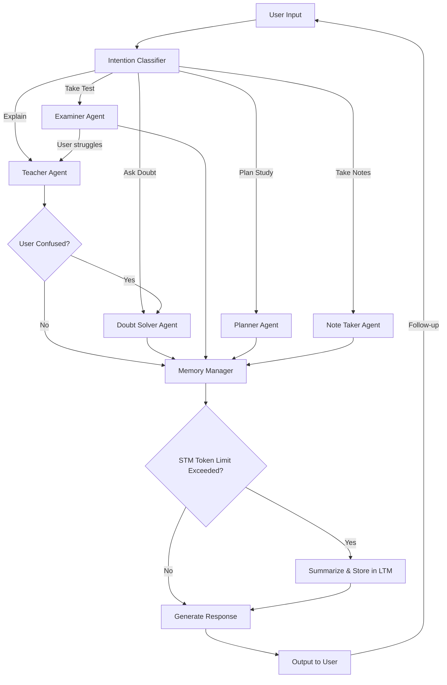

# Agent Interaction Flow Diagram

```mermaid
graph TD
  UserInput[User Input] --> IntentClassifier[Intention Classifier]

  IntentClassifier -->|Explain| Teacher[Teacher Agent]
  IntentClassifier -->|Ask Doubt| DoubtSolver[Doubt Solver Agent]
  IntentClassifier -->|Take Test| Examiner[Examiner Agent]
  IntentClassifier -->|Plan Study| Planner[Planner Agent]
  IntentClassifier -->|Take Notes| NoteTaker[Note Taker Agent]

  Teacher --> CheckConfusion{User Confused?}
  CheckConfusion -- Yes --> DoubtSolver
  CheckConfusion -- No --> MemoryManager[Memory Manager]

  DoubtSolver --> MemoryManager
  Examiner -->|User struggles| Teacher
  Examiner --> MemoryManager
  Planner --> MemoryManager
  NoteTaker --> MemoryManager

  MemoryManager --> TokenCheck{STM Token Limit Exceeded?}
  TokenCheck -- Yes --> Summarize[Summarize & Store in LTM]
  TokenCheck -- No --> ResponseGen[Generate Response]

  Summarize --> ResponseGen
  ResponseGen --> UserOutput[Output to User]

  UserOutput -->|Follow-up| UserInput
```